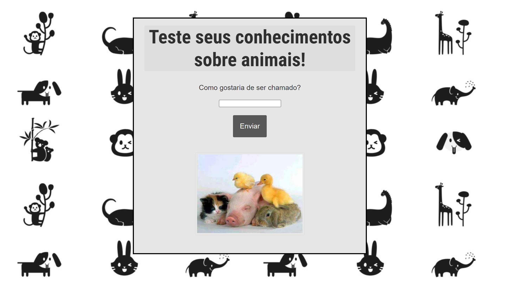
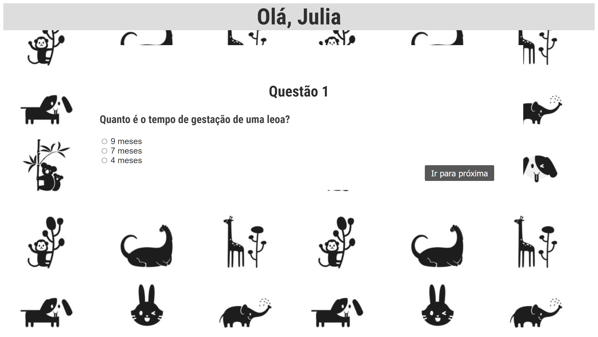
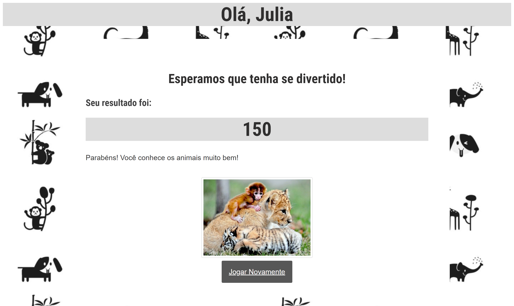

# Trivia

 

## Índice

- [1. Introdução](#1-introduçãodução)
- [2. Sobre o projeto](#2-sobre-o-projetoprojeto)
- [3. Ferramentas utilizadas](#3-ferramentas-utilizadasdas)
- [3. Autoras](#4-autoras)

 

---

## 1. Introdução

Trivia é um tipo de jogo, geralmente no âmbito de uma competição, no qual se coloca uma série de perguntas cujas respostas devem ser escolhidas entre diferentes opções pré-determinadas.

 

## 2. Sobre o projeto

Projeto aprensentado na pré-admissão (que ocorreu dias 06, 07 e 08 de dezembro de 2021) da turma 007 da Laboratória.

 

<h2>Perguntas</h2>
 

  

<h2>Resultado trivia</h2>

 

## 3. Ferramentas utilizadas

Para a construção desse projeto foram utilizadas as seguintes ferramentas:

- HTML
- CSS
- Javascript
- CSS

 

## 4. Autoras

<a href="https://www.linkedin.com/in/julia-benedicto/">Julia Benedicto</a>

Jheovana

